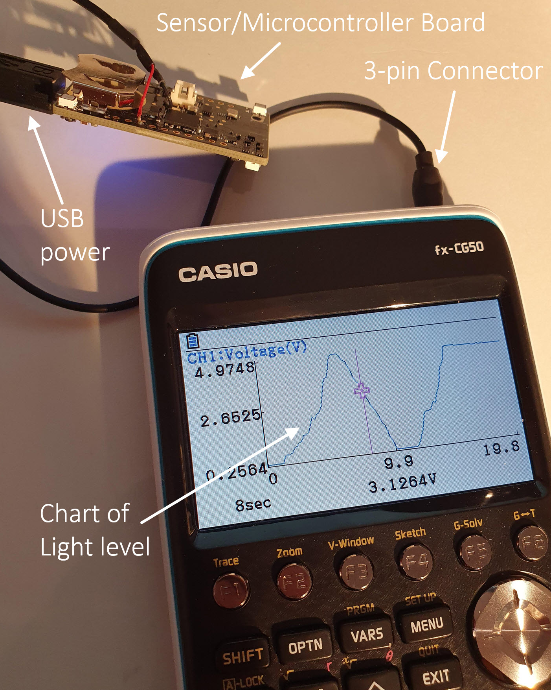
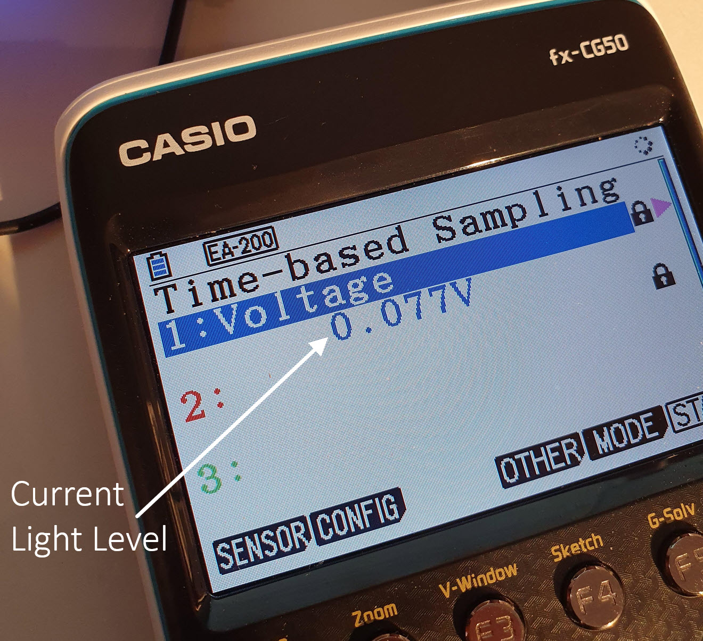
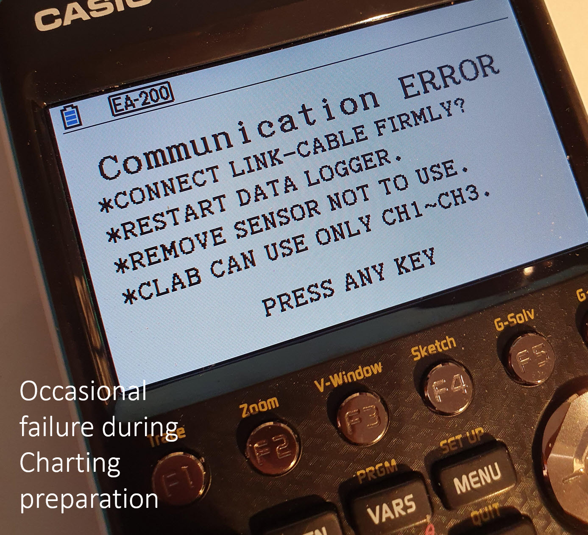

# MiniExperimeter
## Sensing and capturing data for school science experiments

This project connects a Casio calculator to an off-the-shelf sensor/microcontroller board. The aim is to allow sensed data to be captured and charted by the calculator.
This repository contains the code that will run on the sensor/microcontroller board. The board connects to the calculator using a 3-pin connector. The calculator contains built-in data reporting and charting functions, so no calculator programming is required.



Note: The code in this repository is a work-in-progress. It partially works.
The working functionality as of December 2020 is:
* Ability to report the ambient light level or analog sensor data
* Ability to chart the ambient light level or analog sensor data
* Ability to forward data to the cloud via MQTT


The known issues are:
* The light level is currently in arbitrary units, it is not in Lux
* The time axis on the charts is not usable, because the code just sends the measured light level as it becomes available, and not at the required intervals. To fix this, a timer needs to be implemented in the code.
* If the calculator sends an error message, the code doesn't recover gracefully in all circumstances, because code still needs to be written to gracefully recover in all states. This means that the Reset button on the microcontroller board needs to be pressed to manually recover.
* Prior to capturing the data for charting purposes, the Casio calculator sends some setup information. Occasionally this doesn't work, and the calculator sends an error response to the microcontroller board, and the calculator displays an error message. When this occurs, the user needs to press Exit on the calculator, and then reattempt. I don't know the reason why the calculator generates an error.
* High speed capture (less than 0.2 seconds per sample) is not currently possible, because the Casio calculator uses a slightly different mechanism (a non-real-time bulk streaming of data) for high speed, and this is undocumented, and experiments so far have been unsuccessful and reverse-engineering it.
* Only a single channel and particular mode can be configured. Currently the code cannot chart different channels. The calculator needs to be set to Channel 1, Voltage mode. Other channels and modes are not recognized by the microcontroller code currently.


## Using the Project
To use the project, at a high level, there are these main steps which are described in more detail later:
* [Solder a 3-pin connector](hardware-connections.md) to the off-the-shelf sensor/microcontroller board
* [Build the code](building-code.md), to create a .bin file
* [Transfer the code](building-code.md) to the sensor/microcontroller board
* Connect the board to the calculator using the 3-pin connector, and supply power to it (can use a USB supply or plug into a PC)
* On your Casio calculator (which should be running the latest firmware from the Casio website) select Menu->E-CON4. E-CON4 is the built-in application for data capture/logging/charting. You should see a screen titled Time-based Sampling and row 1 will be highlighted (row 1 represents channel 1; the calculator supports multiple data acquisition channels).
* Configure the calculator as follows: Press Shift then Setup, and select the Data Logger to be EA-200 and then press EXE or Exit. ensure row 1 is selected on the screen (it should be by default, otherwise use the cursor keys to select the row number 1) and then press the Sensor soft-key and select CASIO from the list, and then select Voltage from the sub-list that appears. Press the Config soft-key, and set the sampling interval to 0.2 seconds or higher, and the Samples value to something reasonable for a first test, such as 100 samples. Do not set a sampling interval lower than 0.2 seconds, due to one of the known issues listed above. Once you're set, press Exit until you're back on the display titled Time-based Sampling. You should eventually see a voltage value displayed immediately under the row labeled "1:Voltage". It may take around 10 seconds for this to occur. If it doesn't, press the Reset button on the sensor/microcontroller board, and wait another 10 seconds.
* Now that the calculator is reporting the current light level, you can try charting it. Press the Start soft-key. You will see a checklist appear. Press Exe and the calculator will try to set (configure) the sensor/microcontroller board with the configured values such as the interval time and desired number of samples. You may see a Communication Error message (see the list of known issues). If this occurs, press Exit until you're back at the Time-based Sampling screen, wait until you see a measured value reported again, and then try pressing Start again. If you can't get this to work, press the Reset button on the sensor/microcontroller board. Eventually it should work.
* If all goes well, the calculator will have successfully transferred the sampling configuration parameters to the microcontroller board, and you should now see a screen with the text "Start sampling? Press EXE". Press EXE, and the values should be plotted. Try changing the light level around the board, and the chart line should go up or down. Once the chart has plotted the configured number of data points (e.g. 100), you can do things like (say) press the Trace button to see a cursor on the chart, and move left/right with the cursor keys to see each sample value. Press Exit to get out of Trace mode. Press Exit again to get back to the Time-based Sampling screen.

## How does the code work?
The Casio calculator uses a [special protocol](protocol.md) to be able to send and receive values from the microcontroller/sensor board. By sending certain configuration values, the calculator instructs the microcontroller to set up it's hardware for particular channels, type of sensor, and the desired rate and number of samples. The microcontroller performs the measurements and sends the data to the calculator.
Refer to the protocol detail to understand approximately how the code works. The main state machine state names are also listed there.

## Debugging
When the microcontroller board is running, it is also sending debug output over the USB port. So, to debug, you can run USB serial terminal software (such as PuTTY) on the PC and observe the output. Connect at 115200 baud to do this. The level of debug can be set when the code is built. As an example, here is some debug output where the debug level has been set to output a sort of ping-pong diagram (message sequence diagram) of all the lower layer communication between the calculator and the microcontroller. To do this, just make sure that the code contains the line **#define PINGPONG 1**

```
CASIO                            MiniE
  |                                |
  |                                |
  |                          **COMM_IDLE**
  |------0x15-CASIO-START-IND----->|
  |<-----------CODEA_OK------------|
  |                    COMM_WAITING_INSTRUCTION
  |---NAV,L=1,O=1,P=1,A----------->|
  |<-----------CODEB_OK------------|
  |                       COMM_WAITING_DATA
  |--------7-STATUS_CHECK--------->|
  |<-----------CODEB_OK------------|
  |                                |
  |                          **COMM_IDLE**
  |------0x15-CASIO-START-IND----->|
  |<-----------CODEA_OK------------|
```
Alternatively you can modify the code to set **#define HLPP 1** and rebuild it, so that a more higher-level protocol debug output can occur such as this:

```
CASIO                            MiniE
  |                                |
  |---S38K: 6,4------------------->|
  |---S38K: 7--------------------->|
  |<--R38K: 1----------------------|
  |---S38K: 0--------------------->|
  |---S38K: 1,1,2----------------->|
  |---S38K: 10,-2----------------->|
  |---S38K: 12,1------------------>|
  |---S38K: 7--------------------->|
  |<--R38K: 0.4981-----------------|
  |---S38K: 3,0.2,100,0,-1-------->|
  ```
  
  To understand what all this means, refer to the [protocol documentation](protocol.md). 
  
  You can also just have some developer debug output (by setting **#define DEVELOPER 1** in the code) such as this:
  
  ```
waiting start indicator
waiting instruction
received instruction:
3a,4e,41,4c,00,02,00,00,00,01,00,03,ff,41,df  text: ':NAL.........A.'
instruction decoded
received data packet:
3a,36,2c,30,6e  text: ':6,0n'
number of tokens found: 2
waiting instruction
received instruction:
3a,4e,41,4c,00,01,00,00,00,01,00,01,ff,41,e2  text: ':NAL.........A.'
instruction decoded
received data packet:
3a,30,d0  text: ':0.'
number of tokens found: 1
```

## Parts Required
Not a lot is needed to create this project. Apart from the calculator (Casio fx-CG50) all that is required is a microcontroller board with 3.3V logic levels, and a 2.5mm 3-way plug (like a headphone plug but thinner). And some wire.
The **Thunderboard Sense 2** is a suitable USB-powered microcontroller board with many in-built sensors, and it is easy to start with. However, it cannot directly connect to the cloud. If the ability to connect to Microsoft IoT Central is required, then **ESP32** based boards can be used. 

For the plug, **Multicomp PSG01492** works, however the plastic outer barrel is too wide in diameter, and won't allow the plug to click into place properly. The barrel needs to be removed. I used heatshrink sleeving instead, because it is thinner. Refer to the [connections diagram](hardware-connections.md) to see how to wire the plug to the Thunderboard. 

