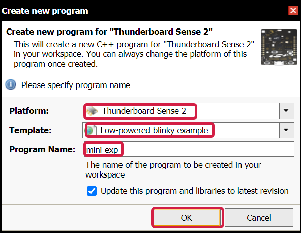
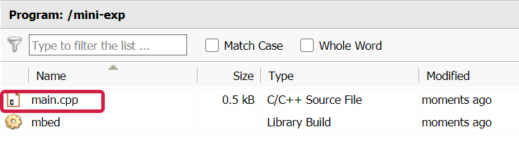
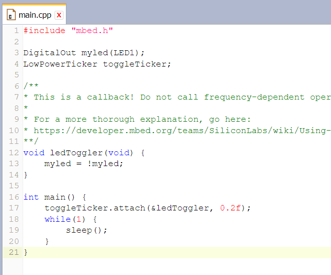
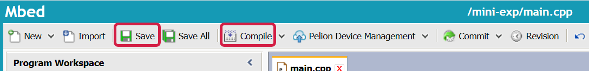
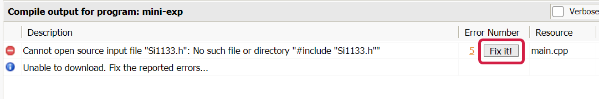
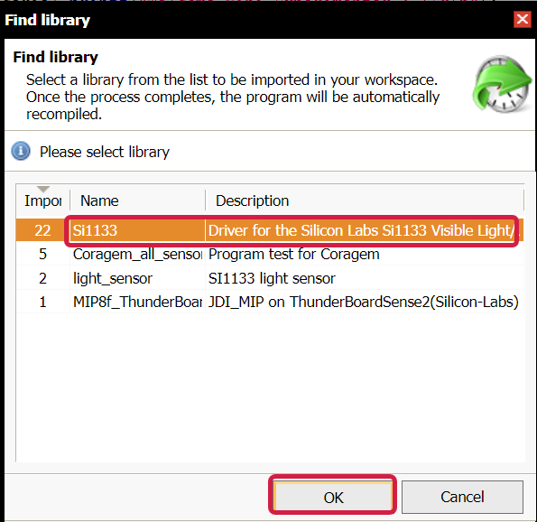
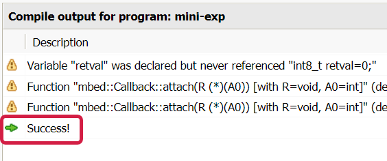
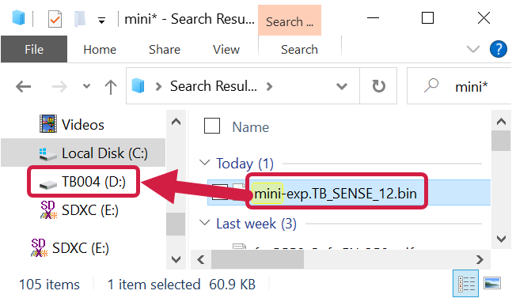
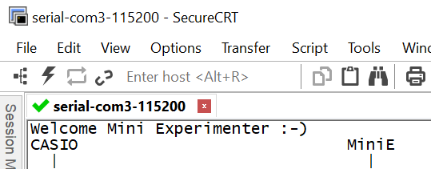

# Building the Code

The details differ depending on which microcontroller board is used.

## Silicon Labs Thunderboard Sense 2

The Thunderboard Sense 2 uses the Mbed development environment.

### Setting up the Development Environment
The steps here will centre around using Mbed, which is an online, browser-based development environment that doesn’t need any PC application to be installed. The usual web browser (such as Chrome) is used, and the code is typed within the browser. A click of a button will compile and build the code, and download it to your PC from the web. Next, you plug in the Thunderboard Sense 2 board into your PC (it has a USB connection) and you can drag-and-drop the built code into the USB storage space that will appear, just as if it were a USB memory stick.

First off, go to https://os.mbed.com/ and create a free account. Then from the top select Hardware->Boards and search or filter for the Thunderboard Sense 2. Click on it to go to the dedicated page for it, and you can bookmark it so that you can refer to it in future. It has useful links and pinout information for the board. On the right side of the page select the button to add the board to your compiler, and then open the Mbed Compiler. 

Create a new program, and select the Thunderboard as the platform and choose an example program. You’ll eventually see a main.cpp file listed. Click on it, and the contents will appear in an editor inside the browser! Now you can edit the code, save it, and press Compile when you’re ready to try it out. If the code compiles successfully then a .bin file will automatically be downloaded by the browser, into your usual downloaded items folder. Then you can drag-and-drop the .bin file into the Thunderboard folder as described earlier.

For now, just to test the process, you could immediately hit Compile without making any changes to main.cpp, and see the built code download onto your PC, and then you can drag it into the Thunderboard folder. NOTE: If you're experiencing difficulty at this point, and the code isn't transferring, or isn't running as expected, then it is highly likely that the 'debugger firmware' on the Thunderboard Sense 2 needs upgrading. This is a one-time thing that will need to be done. To do that, follow the Thunderboard Sense 2 Debugger Upgrading Procedure and then come back here and try again.

### Building the Code
Create a new program in Mbed.

For a template, you can select 'Low powered blinky example'. Give the program a name, for example **mini-exp**

You'll now see a main.cpp file listed. Double-click on it to open it.

Some template code will appear. You can select it all and hit delete, so that you now have an empty main.cpp file.

Next, go to the main.cpp code in the MiniExperimenter github site. [View the code as raw](https://raw.githubusercontent.com/shabaz123/MiniExperimenter/main/code/tbsense2/main.cpp), select it all, and then copy-paste it into the Mbed editor. Now click on Save and then Compile.

You'll see an error appear, because a required library is missing. The library is used for the ambient light sensor which is on the board. To fix the problem, click **Fix It** : )

A list of libraries will appear. Select the correct one as shown in the screenshot here, and then click OK.

The code will now successfully build, and automatically download onto your PC!

You might see some warnings, but the key thing is to see the **Success** message.

Look in your Download folder, to see the automatically downloaded binary executable file. Provided your Thunderboard Sense 2 is plugged into your PC's USB port, you should see a file system called **TB004** or similar. You can just drag the file to that file system, and the board will be automatically programmed, and will begin execution!

If you wish to see what the program is doing, then use a Serial Terminal program such as PuTTY, open the serial port for 115200 baud, 8-N-1, with no flow control, and then press the Reset button on the Thunderboard, and you should start to see debug output appear.

You can now plug the board into the Casio calculator, and run the E-CON4 application that is built-in to the calculator.

