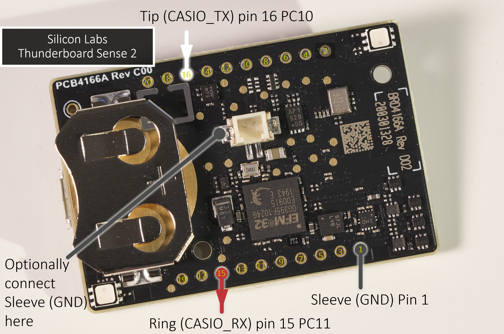
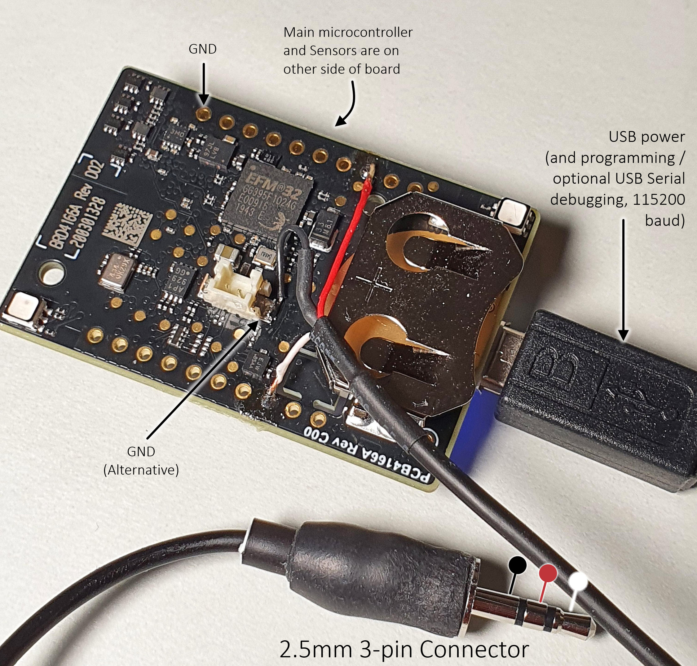

# Hardware Connections
In theory, any microcontroller board with serial capability should be usable. See below for details on how to solder up the connections to the 3-pin plug.

If you wish to try a board not discussed here, then the main requirement is the ability to configure 38400 baud with 2 stop bits, because this is what the Casio calculator requires. The code requires the serial API to support an interrupt whenever a defined number of characters are received over the serial port, or when a particular character is received. The Mbed API supports these features.

## Silicon Labs Thunderboard Sense 2

The photo here shows the required connections.

Note that the 2.5 mm plug barrel needs to be quite narrow (7.5 mm or less) because the socket on the calculator is recessed. Even with a narrow barrel, the connector may still need a bit of force to fully be inserted.
If you cannot find a narrow barrel, you could discard it and use heatshrink as shown in the photo below.

## ESP32
The ESP32 is available is several variants, and there are multiple boards available from different manufacturers. The code was tested using an ESP32-WROOM-32 module. The required connections from the 2.5mm 3-way plug to the ESP32 are:

* CASIO_RX (Ring) connects to GPIO17
* CASIO_TX (Tip) connects to GPIO16
* GND (Sleeve) connects to the ground connection on the ESP32 board/module
* The desired analog sensor (0-3.3V range) connects to GPIO34
