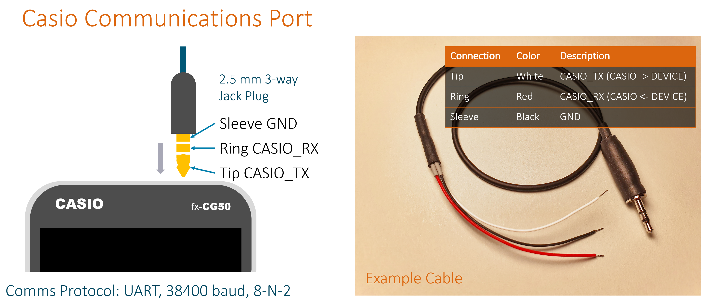
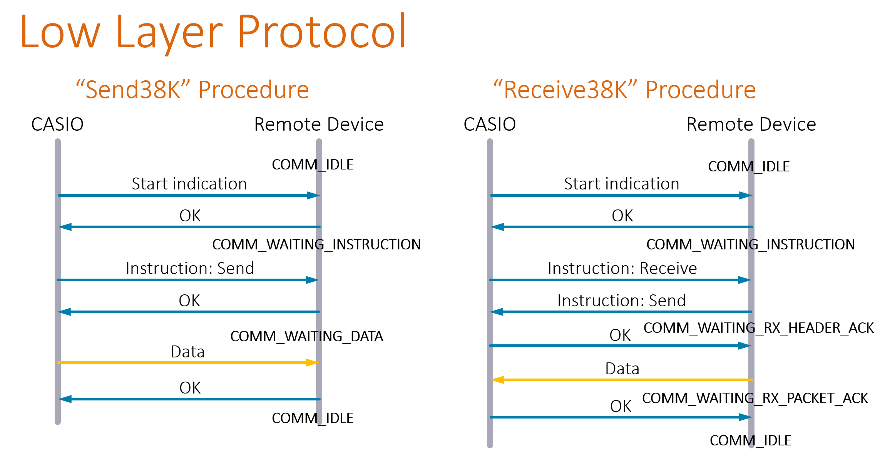
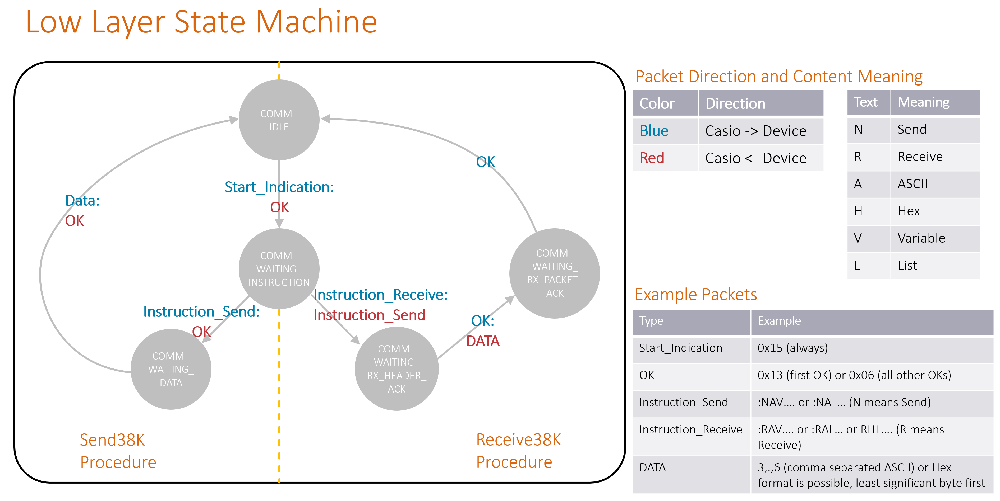
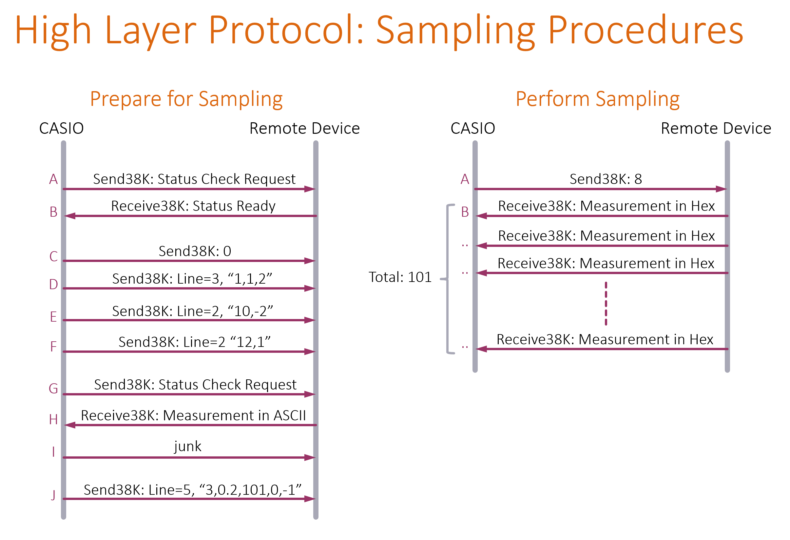

# Protocols
The Casio calculator communications protocol is partially described in the [Casio EA-200 Technical Reference PDF](https://support.casio.com/en/manual/004/EA200_TechnicalReference_EN.pdf). The EA-200 is a Casio data acquisition unit.
Unfortunately, the documentation is incomplete, and in places hard to follow.

## Physical Layer
In brief, the layer 1 communication at the physical voltage level works using 3.3V UART Tx/Rx signals (Idle is high, i.e. opposite of RS-232) at 38400 baud, 8 bits, no parity, and 2 stop bits. The connector is a 2.5 mm 3-pin plug. 

## Low Layer Protocol
At the next layer, let's call it the 'Low Layer Protocol', bytes of data are sent in bundles (let's call them packets). Usually the first byte in the packet is the header byte ':', and the last byte is a checksum. There are single-byte packets too however, with no header or checksum. It is mostly all described in the EA-200 document mentioned above, with a few things missing unfortunately. The protocol has several procedures, of which two are called Send38K and Receive38K. In the diagram here, the arrows indicate the message direction between the calculator and the remote device (microcontroller board). The text beginning with COMM_ are the names of states in a state machine that was created in the code in this project. So, for instance, after reset, the state is COMM_IDLE. When a **Start indication** packet is received (it happens to be a single byte) then the microcontroller must send an OK packet (which again happens to be a single byte) and go to state COMM_WAITING_INSTRUCTION. Most of the other packets are 15 bytes long, but some can be larger or smaller.

Here's the state machine for Send38K and Receive38K procedures (other procedures are possible too, but the code does not implement them).

## High Layer Protocol
Next, there is a 'High Layer Protocol', which uses multiple low-layer Send38K and Receive38K procedures to achieve things. 
For example, to perform charting of data, the calculator will initiate many Send38K and Receive38K procedures to get the remote device ready for sampling. The diagram below shows the detail. Note that even though the Receive38K procedures arrow points from the remote device to the calculator, by examining the low layer detail earlier, you can see that the calculator initiates the Receive38K procedures too.

