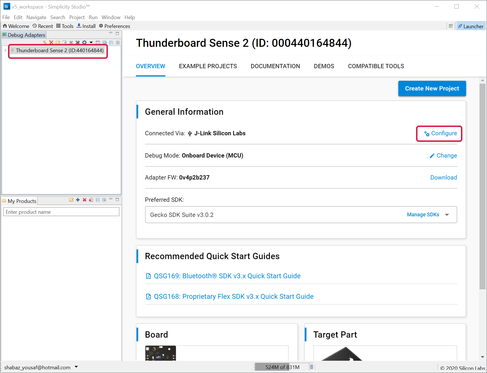
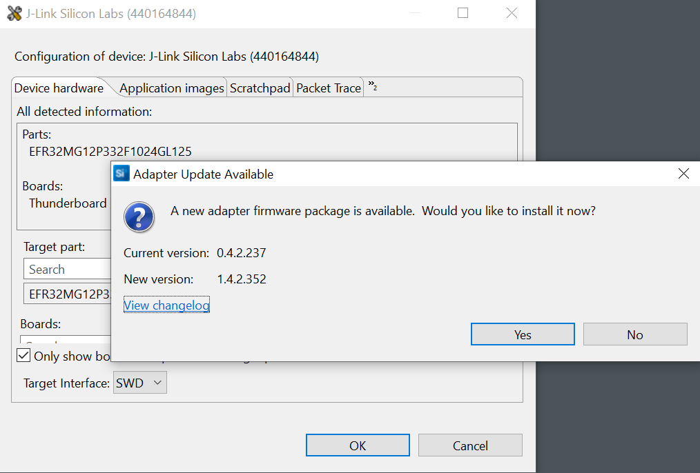
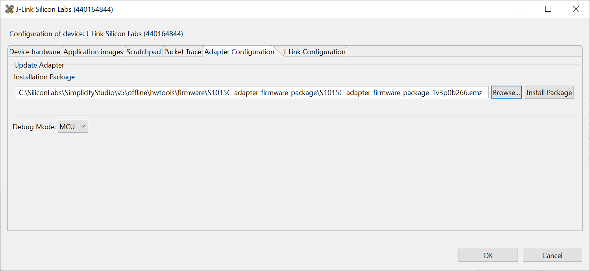

# Thunderboard Sense 2 Debugger Upgrade Procedure
The Thunderboard Sense 2, like other Mbed-enabled boards, actually contains two microcontrollers. One microcontroller is dedicated to acting as a debugger/programmer, and the other microcontroller is the chip where your target code will run.

With new Thunderboards, it is likely that the firmware for the debugger microcontroller needs upgrading, before you can transfer the target code into the main microcontroller.

The prodecure here can be used to perform the upgrade. 

First download a development environment called Simplicity Studio 5 from https://www.silabs.com/developers/simplicity-studio

In Windows 10 you can right-click the downloaded .iso file to mount it, and then double-click on setup.exe to kick off the installation.
Plug in the Thunderboard Sense 2, so that Simplicity Studio can automatically install based on the connected device, and then accept all the defaults until the Simplicity Studio installation is complete. After the software restarts, you should see a main workspace called v5_workspace appear, and the pane on the left side will list the Thunderboard Sense 2 as the connected debug adapter. Click on it, and then in the large main pane under General Information you should see J-Link Silicon Labs as the connection. Click on Configure.

In the window that appears, click on OK if prompted. You want to eventually see an Adapter Update Available pop-up appear, but if it doesn’t, then click on Configure again. Click Yes to update the Adapter firmware.

Unfortunately, the 1.4.2.352 version didn’t work for me when it came to trying it out. If you get an error at a later stage, then come back to this section and then click on the Adapter Configuration tab (if you don’t see this tab, drag to make the window larger), select Browse and choose the 1v3 version, and then click on Install Package to downgrade slightly.

By the end of this stage, your Thunderboard should  be ready to accept new code being dragged into the folder that appears when you connect the Thunderboard USB connection to the PC. The next step is to write some code in a development environment! For this example, Symplicity Studio will no longer be used, but keep it installed on your PC for now, in case the Debugger Adapter Update doesn’t work for the next steps, so that you can downgrade the version as described above.

